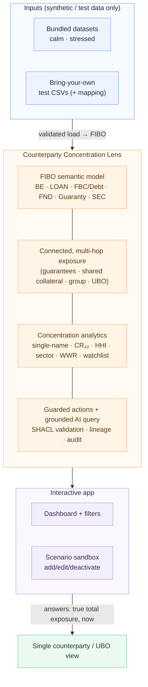

# Counterparty Concentration Lens — a learning prototype

*An open exploration of how a standards-based semantic layer (FIBO) can give a single, real-time, multi-entity view of counterparty exposure — built to understand the pattern, and reusable by anyone who wants to learn it.*

> **What this is:** a learning prototype on **synthetic data**, built end-to-end to understand how ontology-driven operational data platforms work, using the financial industry's own open standard. It demonstrates an architecture and a pattern. **It is not production software**, and it is not affiliated with or directed at any specific institution.

---

## Why this exists

Banks and other large institutions run extensive risk and compliance systems — but much of that machinery was built to produce *periodic reports*, not to answer, in the moment, a deceptively simple question:

> *What is the true, total exposure to a single counterparty or borrower group — right now — across every product, entity, and jurisdiction?*

When the data behind that question lives in many disconnected systems, each with its own definition of "counterparty," "exposure," and "limit," the connected answer is slow and manual to assemble. This is a well-documented, public problem:

- **It has a documented cost.** When Archegos Capital Management defaulted in March 2021, Credit Suisse lost roughly **US$5.5 billion** and was later fined a record **£87 million** by the UK regulator. The bank's own investigation found the risk systems were not lacking and the risks were "conspicuous" — the failure was that no single, timely, connected view reached decision-makers in time. Peers with better-connected views saw the same counterparty and exited cleanly.
- **Regulators require fixing it.** Risk-data aggregation under **BCBS 239** has been mandatory for globally systemic banks since 2016, yet only **2 of 31** were fully compliant as of the 2022 assessment (Basel Committee, published Nov 2023). Supervisors continue to escalate.

These are public facts, cited here to explain *why the pattern matters*. This repository is an **educational exploration of that pattern**, not advice to or about any organisation.

---

## The idea in one diagram

A semantic layer sits **over** existing systems — connecting them into one governed, queryable model — rather than replacing them. The model is built on **FIBO**, the financial industry's open ontology, so "counterparty," "loan," and "exposure" have a single, standards-based definition.



---

## Why FIBO

The **Financial Industry Business Ontology (FIBO)** is an open-source, machine-readable model of financial concepts, developed by the **EDM Council** and standardized by the **Object Management Group (OMG)**. It emerged from the data-governance lessons of the 2008 crisis and is expressed in **OWL 2 DL** (so it supports automated reasoning) with **SHACL** shapes for validation.

This prototype uses the FIBO modules relevant to counterparty exposure:

| Concept | FIBO module |
|---|---|
| Legal entities, ownership & control chains | **Business Entities (BE)** |
| Loan contracts (commercial, retail, etc.) | **Loan (LOAN)** domain |
| Debt instruments, interest & debt terms | **Debt & Equities** module in **Financial Business & Commerce (FBC)** |
| Contract / agreement / party-role machinery | **Foundations (FND)** |
| Guarantees & collateral | **Guaranty** package in FBC |

A key modelling point worth understanding: in FIBO, **"counterparty" is a role, not a separate class.** One legal entity plays many roles — borrower, counterparty, guarantor, beneficial owner — through FIBO's role machinery. That is exactly what lets the model see that the borrower on one loan is the guarantor on another: the multi-hop connection a flat, relational warehouse loses.

---

## What the prototype demonstrates

- A **single connected exposure view** across entities and products, from a FIBO-based model.
- **Multi-hop concentration** that no single source system sees (shared collateral, guarantee chains, group structures, ultimate-beneficial-owner roll-up).
- **Concentration metrics** computed direct-vs-connected — single-name limit utilisation, CR₁₀, HHI, sector concentration — plus a limit early-warning watchlist and a structural wrong-way-risk flag.
- A **grounded query layer** — natural-language questions answered by generated queries over the governed model, not by a black-box guess.
- An **interactive scenario sandbox** — filter, explore, and (on synthetic data) add/edit/deactivate through the validated action layer, watching the metrics move live.
- **Bring your own test data** — load your own synthetic/sample CSVs (with optional column mapping), validated on the way in. *Test data only — see the boundary below.*
- **Lineage and audit** on every figure — the traceability that BCBS 239 calls for.

All on **synthetic data**, runnable on a laptop.

---

## Architecture & learning path

This prototype is built on the same layered, open-source stack documented in the companion learning lab. Each layer has a clean open-source component:

| Layer | Component |
|---|---|
| Semantic model | OWL 2 DL / FIBO (vendored) + a thin, hand-authored application ontology |
| Triplestore + query | Apache Jena Fuseki + SPARQL |
| Validation / rules | SHACL (pySHACL) |
| Action services | FastAPI |
| Access control | Open Policy Agent (OPA) |
| Grounded AI | safety-validated NL→SPARQL — deterministic templates, with a local LLM (Ollama) when available |
| App | Streamlit |
| Infra / delivery | k3d (Kubernetes) + Argo CD (GitOps) + OPA Gatekeeper (admission policy-as-code) |
| Scale (capstone) | Apache Spark (PySpark) ingestion equivalent |

See [`docs/`](docs/) for the full lab handbook, the architecture and diagrams, the open-source-stack mapping, the FIBO module notes, and the [engineering & DevSecOps practices](docs/engineering-practices.md) applied throughout.

This prototype is built to **production-shaped** standards — it demonstrates DevSecOps and secure-engineering practice at each stage (CI gates, tests, dependency/secret/SAST/container scanning, SBOM, authorization-as-code, validation-as-code) — but it is **not production-hardened**. See [`SECURITY.md`](SECURITY.md) for the honest boundary.

---

## Repo structure

```
.
├── README.md                  ← you are here
├── LICENSE
├── SECURITY.md                 ← production-shaped vs production-hardened boundary
├── .pre-commit-config.yaml     ← local quality + security hooks
├── .github/
│   ├── workflows/ci.yml        ← lint, type, test, scan, SBOM
│   └── dependabot.yml
├── docs/
│   ├── lab-handbook.md         ← step-by-step build, module by module
│   ├── architecture.md         ← diagrams (light-theme Mermaid)
│   ├── oss-stack-mapping.md    ← platform layers → open-source equivalents
│   ├── engineering-practices.md← DevSecOps & SDLC practices (incl. policy-as-code)
│   ├── concentration-metrics.md← metric defs, sandbox, calm/stressed design
│   ├── data-import.md          ← bring-your-own test-data guide + scope boundary
│   └── fibo-notes.md           ← which FIBO modules, and why
├── vendor/
│   └── fibo/                   ← FIBO ontology files (attributed)
├── templates/                  ← CSV templates for bring-your-own test data
├── m0-ontology/                ← FIBO model + Fuseki + concentration SPARQL
├── m1-ingestion/               ← synthetic data (calm/stressed) + import loader
├── m2-actions/                 ← SHACL + FastAPI guarded actions (+ import validation)
├── m3-security/                ← OPA policy scoping (authz as code)
├── m4-ai/                      ← grounded NL→SPARQL agent (query-safe)
├── m5-app/                     ← Streamlit interactive app + scenario sandbox (the demo)
└── m6-infra/                   ← k3d + Argo CD + Gatekeeper + image scan + SBOM
```

---

## What this is *not*

Being precise here is part of the point:

- **Not production software.** A learning prototype on synthetic data, single-instance, laptop-scale. Not scalable, hardened, or operated as built.
- **Not financial, legal, or compliance advice.** The Archegos and BCBS 239 references are public facts included to explain why the pattern matters — nothing here is advice to any institution.
- **Not affiliated** with EDM Council, OMG, or any bank. FIBO is used under its open licence; FIBO is a trademark of EDM Council, Inc.
- **Not a real risk system.** A better connected *view* surfaces a concentration or breach; acting on it is a matter of governance and people, which no prototype provides.

---

## Datasets & what the numbers mean

The Lens ships with **two synthetic datasets**, both entirely fictional:

- **`calm`** (the default on a fresh clone) — exposures sit within normal risk bands. This is what you see on first run.
- **`stressed`** (opt-in) — the same entities with exposures **deliberately engineered to breach** risk thresholds (single-name limits, CR₁₀, HHI, sector concentration, an NBFI cascade, a wrong-way-risk case). It exists to demonstrate that the metrics compute correctly and that hidden, connected exposure can breach limits that direct exposure does not.

> The stressed numbers are **illustrative and intentionally engineered** — they are *not* realistic portfolio statistics. The app always shows a banner stating which dataset is loaded. Switching is one command (see below); it never requires editing code.

### Bring your own test data

You can also try the Lens on **your own data** instead of the bundled sets — useful for exploring your own scenarios:

- **Template CSVs** — copy the documented templates (`templates/`), fill them with your data in the same shape, and load with `--source <folder>`.
- **Mapping config** — if your CSVs have different column names, supply a small YAML mapping file (`--mapping <map.yaml>`) that translates your columns/values to the Lens schema.

Imported data is **validated on the way in** (through the same SHACL guard as every other write) and loaded as its own named dataset, so it never overwrites the bundled `calm`/`stressed` sets — and "reset to calm/stressed" always brings you back. You get a per-row report of what was accepted or rejected and why. See [`docs/data-import.md`](docs/data-import.md) for the full guide.

> **⛔ Test/synthetic data only.** This import path is for synthetic, sanitised, or sample **test** data — **not** real, production, customer, or regulated counterparty data. The Lens is a learning prototype (not production-hardened; see [`SECURITY.md`](SECURITY.md)) with no security suitable for real exposure data. The correct path for real data is a contained proof of concept in your own environment, with your security team — not this prototype. Live integration to source systems (databases, APIs) is deliberately out of scope.

## Getting started

Everything is free and open-source; no cloud account or API key is required. A fresh clone loads the **calm** dataset by default.

Quickstart (high level — see [`docs/lab-handbook.md`](docs/lab-handbook.md) and each module's README for detail):

1. Create a virtualenv and `pip install -r requirements-dev.txt` (dev gates) and the module requirements.
2. Fetch the FIBO modules into `vendor/fibo/` — **BE, LOAN, FBC/Debt, FND, Guaranty, and SEC** (SEC is needed for securities-as-collateral / wrong-way-risk).
3. Generate and load the **calm** dataset, then stand up Fuseki (see `m1-ingestion/data/README.md` for exact commands).
4. Launch the app (`m5-app/`) — you'll see the calm dataset and its banner.
5. To see the concentration metrics breach, switch to the **stressed** dataset (one documented command/flag) and reload — the dashboard moves from green to red.

Build it yourself module by module starting at `m0-ontology/`, or just run the finished stack. See [`docs/concentration-metrics.md`](docs/concentration-metrics.md) for the metric definitions and the calm/stressed design.

To try it on your own scenarios instead of the bundled data, see **[Bring your own test data](#bring-your-own-test-data)** above (synthetic/sample test data only).

---

## License & attribution

Released under the [MIT License](LICENSE) — you're free to learn from, fork, and reuse it. FIBO content is © EDM Council and used under its open licence; please observe FIBO's own terms for the ontology files. Public figures (Archegos, BCBS 239) are drawn from regulatory and industry sources; see [`docs/fibo-notes.md`](docs/fibo-notes.md) for references.
