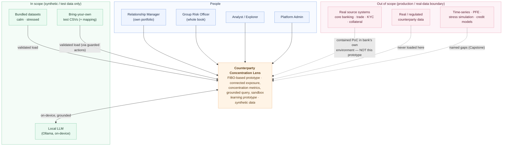
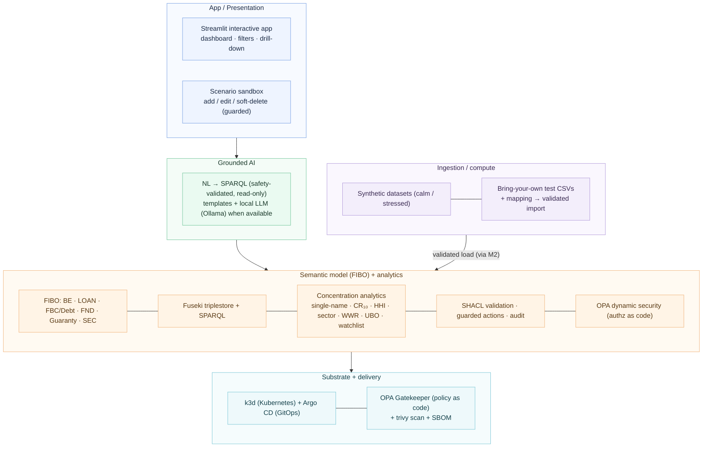
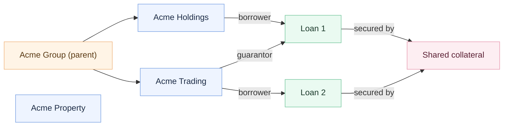
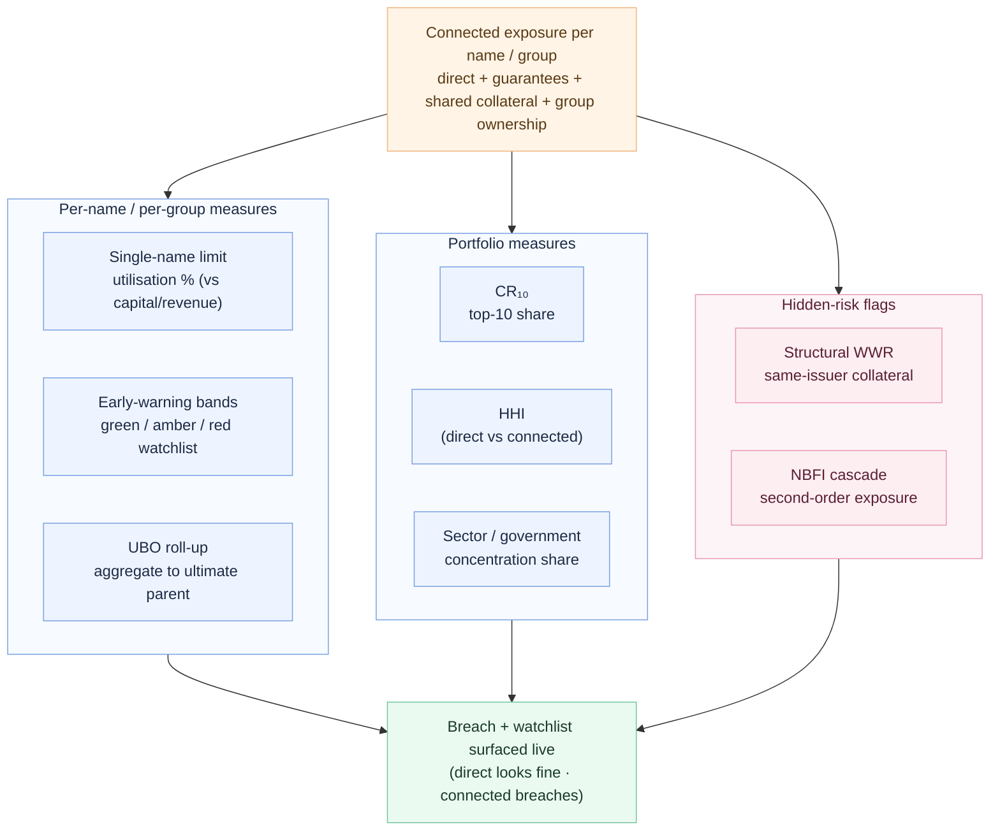

# Architecture — Counterparty Concentration Lens

*A learning prototype. Synthetic data. Not production software.*

The Lens is a **semantic layer that sits over source systems** and connects them into one governed, queryable model built on FIBO. It does not replace source systems; in this prototype the "source systems" are synthetic CSVs standing in for separate real systems.

## System context

Who and what sits around the Lens — and, importantly, where the boundary is. Solid arrows are in scope (synthetic / test data only); dashed arrows mark the deliberate boundary to real systems, real data, and production-only capabilities.

The dashed boundary is the point: real source systems, real data, and production-only risk capabilities sit *outside* the prototype by design. The Lens reads roles (relationship manager vs group risk) to scope what each person sees, runs an on-device LLM so nothing leaves the machine, and accepts only synthetic/test inputs through a validated load path.

## Layered view

## Why the multi-hop view is the point

A per-system view sees Loan 1 and Loan 2 as separate, modestly-sized exposures. The connected FIBO model sees that they share collateral, sit under one parent group, and are cross-guaranteed — so the *true* concentrated exposure is far larger than any single system reports. Surfacing that gap is the demo.

## Concentration analytics

Every metric is computed on **connected exposure** (the number above), then expressed in the forms a risk function uses. The recurring punchline: a name or portfolio looks acceptable on *direct* exposure but breaches once the hidden, connected exposure is counted.

Thresholds (illustrative): single-name > 25% of capital / > 10% of revenue; CR₁₀ > 60–70%; HHI > 0.18; sector > 30%. See `concentration-metrics.md` for exact definitions. PFE / time-series, stress-shock simulation, and full credit-modelling are deliberately out of scope.

## Component choices (all free / open-source)

| Layer | Component |
|---|---|
| Semantic model | OWL 2 DL / FIBO (vendored) + a thin, hand-authored application ontology |
| Triplestore + query | Apache Jena Fuseki + SPARQL |
| Validation / rules | SHACL (pySHACL) |
| Action services | FastAPI |
| Access control | Open Policy Agent (OPA) |
| Grounded AI | safety-validated NL→SPARQL — deterministic templates, with a local LLM (Ollama) when available |
| App | Streamlit |
| Infra / delivery | k3d (Kubernetes) + Argo CD (GitOps) + OPA Gatekeeper (admission policy-as-code) |
| Scale (capstone) | Apache Spark (PySpark) ingestion equivalent |

See `oss-stack-mapping.md` for how these map to the layers of a commercial platform, and `fibo-notes.md` for the FIBO modules.
