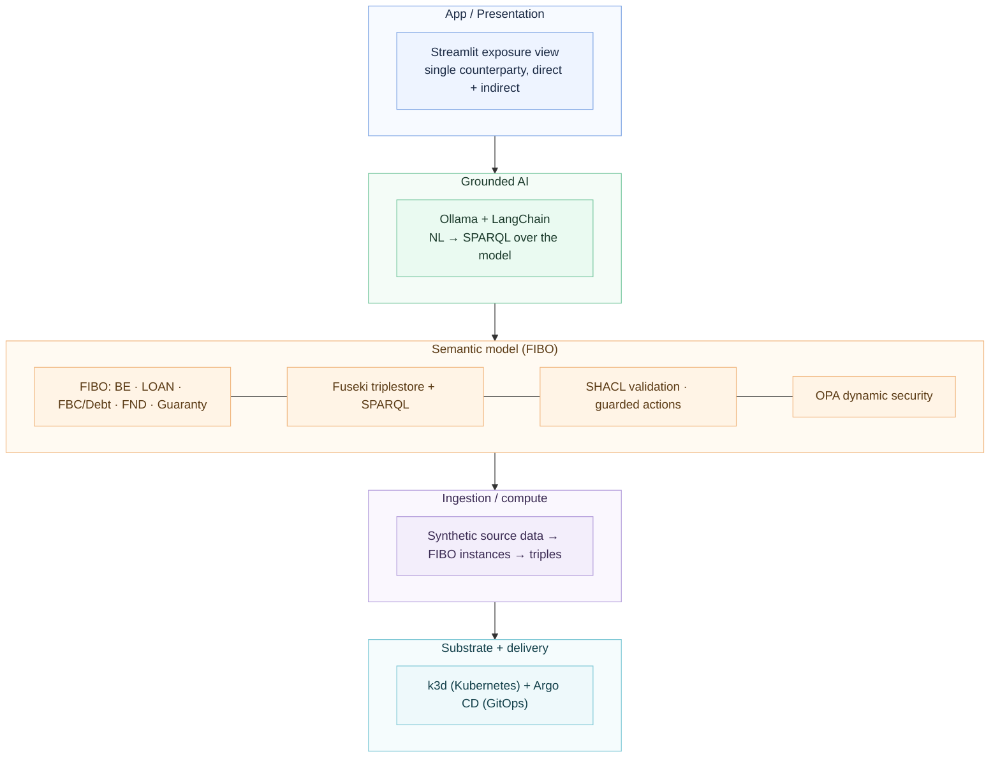
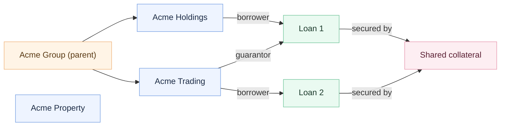

# Architecture — Counterparty Concentration Lens

*A learning prototype. Synthetic data. Not production software.*

The Lens is a **semantic layer that sits over source systems** and connects them into one governed, queryable model built on FIBO. It does not replace source systems; in this prototype the "source systems" are synthetic CSVs standing in for separate real systems.

## Layered view

## Why the multi-hop view is the point

A per-system view sees Loan 1 and Loan 2 as separate, modestly-sized exposures. The connected FIBO model sees that they share collateral, sit under one parent group, and are cross-guaranteed — so the *true* concentrated exposure is far larger than any single system reports. Surfacing that gap is the demo.

## Component choices (all free / open-source)

| Layer | Component |
|---|---|
| Semantic model | OWL / FIBO, authored in Protégé |
| Triplestore + query | Apache Jena Fuseki + SPARQL |
| Validation / rules | SHACL (pySHACL) |
| Action services | FastAPI |
| Access control | Open Policy Agent (OPA) |
| Grounded AI | Ollama (local LLM) + LangChain |
| App | Streamlit |
| Infra / delivery | k3d (Kubernetes) + Argo CD |

See `oss-stack-mapping.md` for how these map to the layers of a commercial platform, and `fibo-notes.md` for the FIBO modules.
