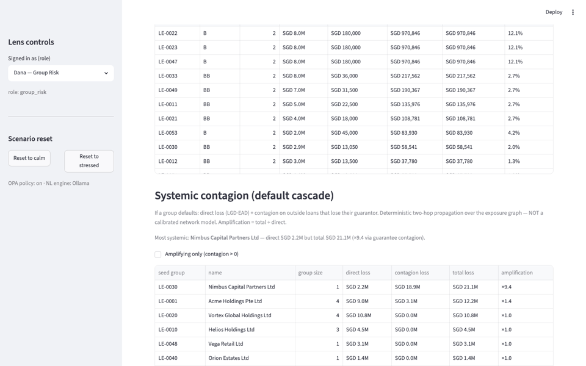
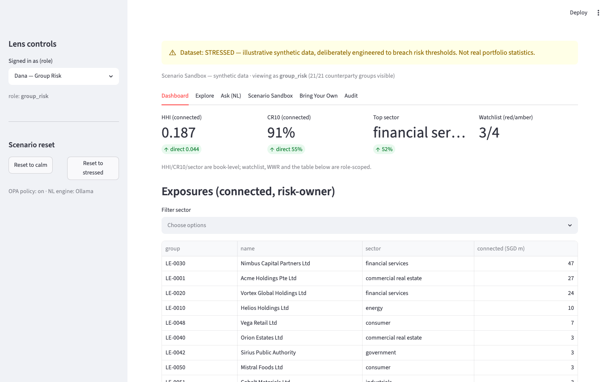
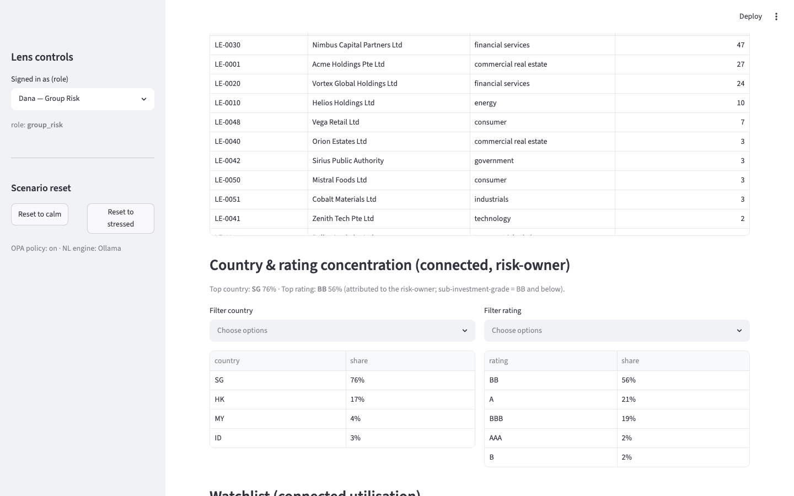
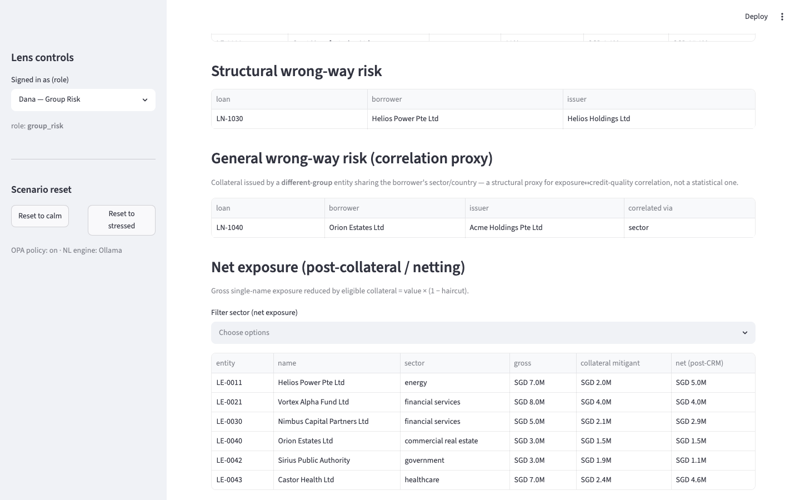
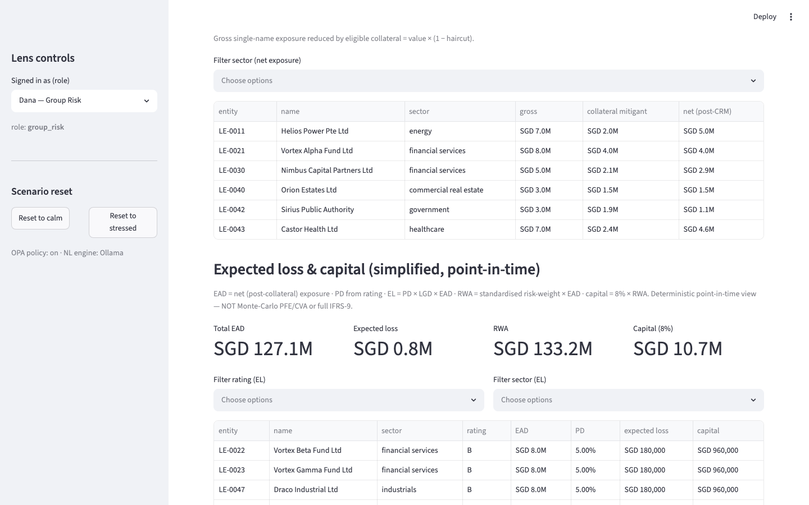
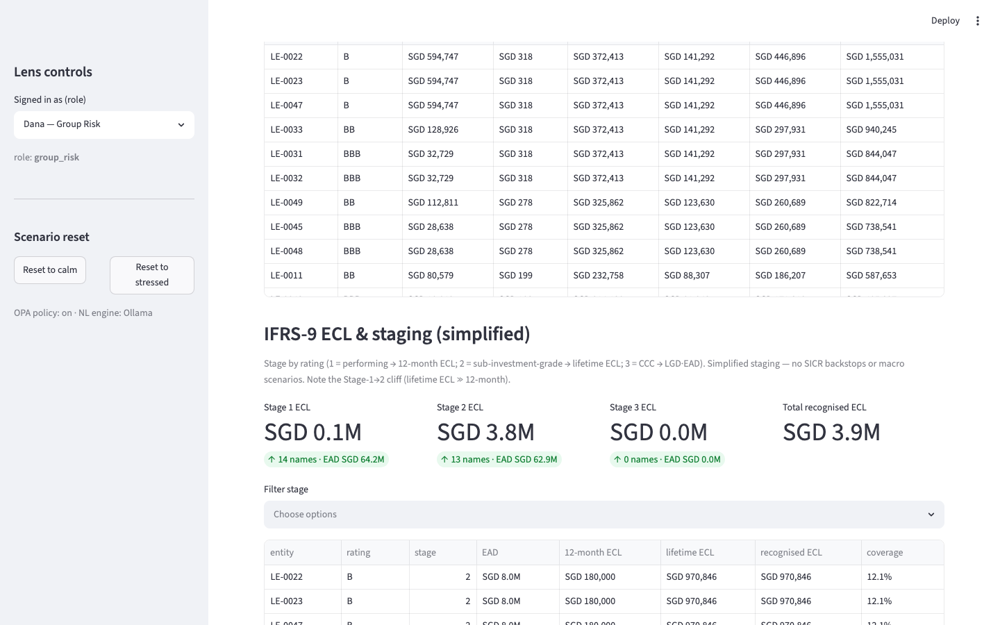
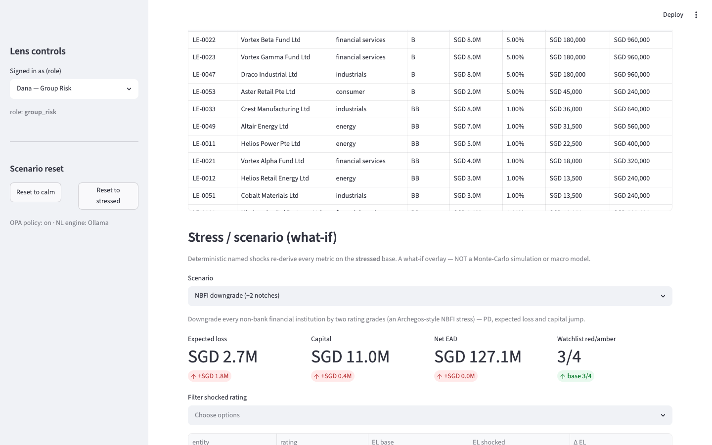
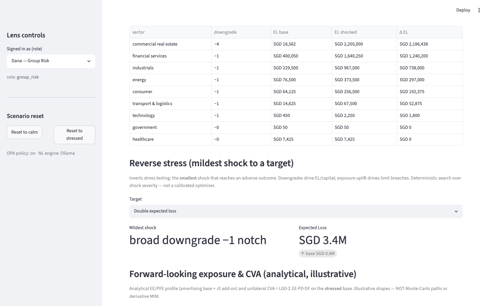
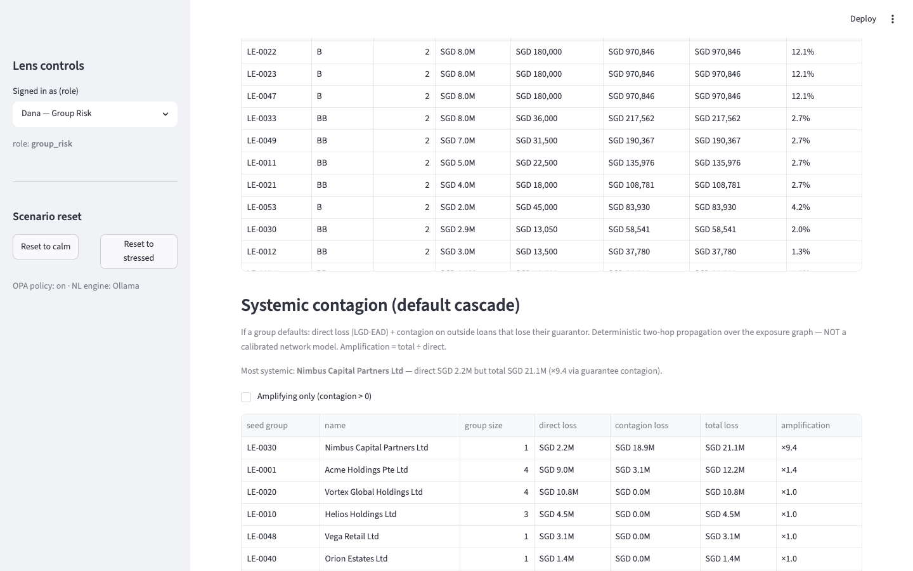
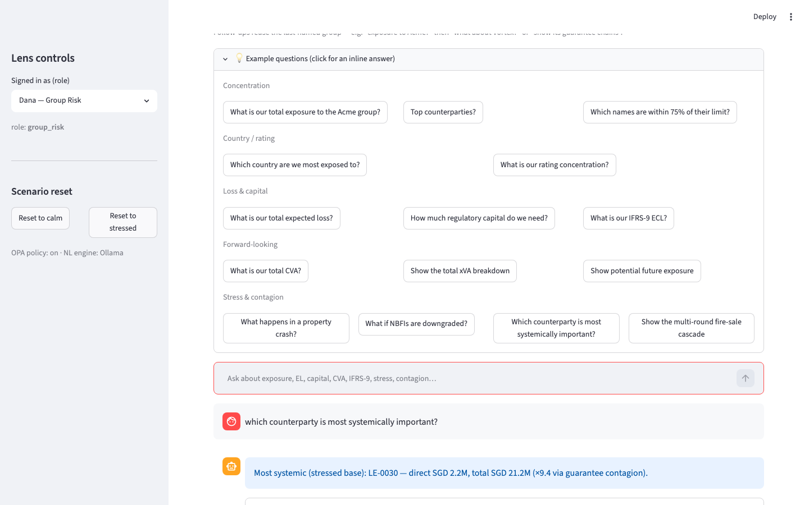

# CCR Demo & User Guide

How to **use and demo every counterparty-credit-risk (CCR) capability** in the Lens.
Each capability lists: *what it shows · where in the app · what to do · what to ask (the
NL chat) · what to expect*. All figures are from the bundled **`stressed`** synthetic
dataset — obviously-fake names, engineered to make the risks visible.

> **Honesty note.** The quantitative / simulation-dependent capabilities (PFE/EE, xVA,
> IFRS-9, stress/macro, contagion, reverse stress) are **deliberately simplified,
> clearly-labelled** models — real *shape*, illustrative calibration, never Monte-Carlo
> or live market data. The full capability map (✅ / ⚠️ / ❌) is
> [`ccr-coverage.md`](ccr-coverage.md).



*A scroll through the demo screen (stressed dataset). Screenshots below are captured from
the running app — reproduce them with `python docs/img/capture.py` (see that file).*

---

## 0. Bring-up (2 minutes)

Full detail in [`running-the-lens.md`](running-the-lens.md); the short version:

```bash
# 1) Start Fuseki (triplestore) and load FIBO + the stressed synthetic dataset
#    (from m0-ontology/ then m1-ingestion/ — see running-the-lens.md)
m0-ontology/scripts/start_fuseki.sh
python -m scripts.load_data --dataset stressed          # from m1-ingestion/

# 2) (optional) OPA for role scoping; local Ollama for the LLM path
brew install opa            # dynamic authorization
ollama serve && ollama pull llama3.2   # optional — templates work without it

# 3) Launch the app
streamlit run streamlit_app.py          # from m5-app/
```

**Orientation.** The sidebar picks your **role** (Dana — Group Risk sees everything;
the RMs see only their desk) and **resets** to the `calm` or `stressed` base. Use
**stressed** for the demo. Six tabs: **Dashboard · Explore · Ask (NL) · Scenario Sandbox
· Bring Your Own · Audit**. Two ways to drive everything: click the **Dashboard**
sections, or chat in **Ask (NL)** — every capability has an NL question.

---

## 1. The 5-minute demo (the through-line)

One story ties the whole stack together: **Nimbus** (a small direct exposure that is
huge once connected) and **Borealis** (a name that looks fully protected but isn't).

| Step | Do / ask | The "aha" |
|---|---|---|
| 1. Connected concentration | Ask *"what is our total exposure to the Acme group?"* | Direct looks fine; **connected ≈ 34M breaches the 25M limit** (guarantees + shared collateral + group). |
| 2. Who's systemic | Ask *"which counterparty is most systemically important?"* | **Nimbus** — direct **2.2M** but total **21.2M** (**×9.4**) via its guarantee web. |
| 3. Loss & capital | Ask *"what is our total expected loss?"* then *"how much regulatory capital?"* | **EL ≈ 0.8M**, **capital ≈ 10.7M** (10.7% of eligible); the **B-rated** names dominate. |
| 4. Provisioning cliff | Ask *"what is our IFRS-9 ECL?"* | Lifetime staging lifts recognised ECL to **≈ 3.9M** (Stage 2 ≫ 12-month). |
| 5. Forward / xVA | Ask *"what is our total CVA?"* then *"show the total xVA breakdown"* | Long-tenor sub-IG names dominate; **CVA ≈ 2.5M, total xVA ≈ 13.7M**. |
| 6. Stress it | Ask *"what happens in a property crash?"* | **EL 0.8M → 5.5M**; CRE hit −4 notches, government resilient. |
| 7. Hidden contagion | Dashboard → **Multi-round cascade** | **Borealis** = **0 loss single-round** (guaranteed by Acme) but **15.3M over 2 rounds** — the guarantee topples Acme (4 second-order defaults). |

That arc — *connected concentration → loss → capital → forward exposure → provisioning →
stress → systemic contagion* — is the demo. The rest of this guide is the reference.

---

## 2. Capability-by-capability reference

### A. Concentration & the connected core

| Capability | Where | Do / Ask | Expect |
|---|---|---|---|
| Single-name & connected exposure | **Dashboard → Exposures** / **Explore** | Explore → pick **Acme**; or ask *"exposure to the Acme group?"* | Direct vs **connected**; the contributing paths (guarantees, shared collateral, group). |
| Group / UBO aggregation & limit | **Explore** | Pick a group → the **limit-breach verdict** on connected | Connected breaches where direct passes. |
| HHI / CR₁₀ (direct vs connected) | **Dashboard** top metrics | — | Connected HHI/CR₁₀ ≫ direct. |
| Sector concentration | **Dashboard → Exposures** filter | Ask *"which sector are we most concentrated in?"* | Financial services > 30% (the NBFI cluster). |
| **Country concentration** | **Dashboard → Country & rating** (+ *Filter country*) | Ask *"which country are we most exposed to?"* | **SG 76%**; HK 17% (the NBFI cluster). |
| **Rating concentration** | same section (+ *Filter rating*) | Ask *"what is our rating concentration?"* | **BB 56%** — majority **sub-investment-grade**. |
| NBFI cascade / systemic importance | **Dashboard → Systemic contagion** | Ask *"which counterparty is most systemically important?"* | **Nimbus ×9.4** (2.2M direct → 21.2M total). |




### B. Netting, collateral & CRM

| Capability | Where | Do / Ask | Expect |
|---|---|---|---|
| **Net (post-collateral) exposure** | **Dashboard → Net exposure** (+ *Filter sector*) | Ask *"what is the net exposure after collateral?"* | **Helios 7.0M gross → 5.0M net** (4M bond @ 50% haircut). Filter to *financial services* → Vortex + Nimbus. |



### C. Credit quality, loss & capital

| Capability | Where | Do / Ask | Expect |
|---|---|---|---|
| **EAD / PD / LGD / Expected Loss** | **Dashboard → Expected loss & capital** (+ *rating/sector filters*) | Ask *"what is our total expected loss?"* | Portfolio **EL ≈ 811k**; per-name EAD·PD·EL·capital; B-names top. |
| **RWA / regulatory capital** | same section (metrics row) | Ask *"how much regulatory capital do we need?"* | **≈ 10.7M** (10.7% of eligible capital). |
| **IFRS-9 staging & lifetime ECL** | **Dashboard → IFRS-9 ECL & staging** (+ *Filter stage*) | Ask *"what is our IFRS-9 ECL?"* / *"lifetime expected credit loss"* | Stage 1/2/3 metrics; **recognised ECL ≈ 3.9M** vs the 12-month 0.8M (the cliff). |




### D. Forward-looking exposure & xVA

| Capability | Where | Do / Ask | Expect |
|---|---|---|---|
| **PFE / EE profile** | **Dashboard → Forward-looking exposure & CVA** → *EE/PFE profile* chart | pick a counterparty → the profile chart | The classic **PFE hump** (rises above current, then amortises). |
| **CVA** | same section table | Ask *"what is our total CVA?"* / *"potential future exposure"* | Long-tenor sub-IG names top; **CVA ≈ 2.5M**. |
| **Full xVA (CVA·DVA·FVA·MVA·KVA)** | same section → *Full xVA breakdown* (+ *rating filter*) | Ask *"show the total xVA breakdown"* / *"FVA and KVA"* | **Portfolio total xVA ≈ 13.7M** (DVA ≈ 0 for a loan book). |


### E. Stress & scenario

| Capability | Where | Do / Ask | Expect |
|---|---|---|---|
| **Named stress scenarios** | **Dashboard → Stress / scenario** (scenario picker) | Ask *"what happens to expected loss if NBFIs are downgraded?"* | **NBFI downgrade EL 0.8M → 2.7M** (Vortex Beta B→CCC); base-vs-shocked deltas. |
| **Macro / multi-factor (correlated)** | **Dashboard → Macro / multi-factor stress** | Ask *"what happens in a property crash?"* / *"recession"* | **Property crash EL 0.8M → 5.5M**, CRE −4; **recession → 7.0M**; government resilient. |
| **Reverse stress** | **Dashboard → Reverse stress** (target preset) | Ask *"what is the mildest shock to double expected loss?"* | *Double EL* = **−1 notch**; *capital ≥ 15%* = **−3 notches**; *≥6 breaches* = **+30% exposure**. |




### F. Default management & systemic contagion

| Capability | Where | Do / Ask | Expect |
|---|---|---|---|
| **Contagion cascade (jump-to-default)** | **Dashboard → Systemic contagion** (+ *amplifying-only*) | Ask *"show the default contagion cascade"* | Per-group direct + guarantee-contagion + amplification; **Nimbus ×9.4**. |
| **Multi-round + fire-sale spirals** | same section → *Multi-round cascade* (+ *second-order only*) | Ask *"show the multi-round fire-sale cascade"* | **Borealis 0 single-round → 15.3M over 2 rounds** (topples Acme; 4 second-order). |



### G. Wrong-way risk

| Capability | Where | Do / Ask | Expect |
|---|---|---|---|
| **Structural (specific) WWR** | **Dashboard → Structural wrong-way risk** | Ask *"any wrong-way risk?"* | **Helios** loan vs a **Helios Holdings** bond (same group). |
| **General (correlation-proxy) WWR** | **Dashboard → General wrong-way risk** | Ask *"show general wrong-way risk"* | **Orion (CRE)** collateral issued by **Acme (CRE, different group)** — correlated via *sector*. |

### H. Limits & control

| Capability | Where | Do / Ask | Expect |
|---|---|---|---|
| Limit utilisation / watchlist | **Dashboard → Watchlist** (+ *Filter band*) | Ask *"which names are within 75% of their limit?"* | Red/amber names on the connected basis. |
| **Pre-deal / dynamic / tenor / settlement limits** | **Scenario Sandbox → Pre-deal limit check** | pick borrower + amount + tenor → **Run pre-deal check** | Acme +5M → **breach** (post 39M > 25M); tenor 10y → **tenor breach** (7y cap); a BB name → effective limit = base **× 0.80** (dynamic). No write. |

### I. Governance & controls

| Capability | Where | Do / Ask | Expect |
|---|---|---|---|
| Validation-as-code (SHACL) | **Scenario Sandbox → Add a loan** | Submit an over-limit / dangling reference | **Rejected before write**, with a reason; audited. |
| Dynamic authorization (OPA/M3) | **Sidebar → role** | Switch Dana → an RM | The RM sees only their desk (fewer groups; scoped tables + NL answers). |
| **Maker-checker (four-eyes)** | **Scenario Sandbox → Maker-checker approvals** | As an RM: **Submit for approval**; switch to **Dana (group_risk)**: **Approve** | Submit → *pending* (no effect). Self-approve → **four-eyes blocked**. A different group_risk checker → **applied**; a metric moves; the queue clears. |
| Tamper-evident audit trail | **Audit** tab | perform any guarded action, then open Audit | Hash-chained trail of who/what/when; `/audit/verify` confirms integrity. |
| **Bring-your-own test data** | **Bring Your Own** tab | point at `templates/`, **Validate & import via M2** | Per-row accepted/rejected report; loads as a *named* dataset; the banner shows **IMPORTED**. *(Synthetic/sample test data only.)* |

---

## 3. NL chat — the full question cheat-sheet

Open **Ask (NL)**. Click a **💡 palette** example for an inline answer per area, or type
freely. Follow-ups carry context: *"exposure to Acme?"* → *"what about Vortex?"* /
*"show its guarantee chains"*. Every answer shows the generated, read-only, validated
SPARQL (or a "computed" note) and is role-scoped.



- **Concentration** — "total exposure to the Acme group?" · "top counterparties?" ·
  "which names are within 75% of their limit?" · "show guarantee chains touching Nimbus" ·
  "which sector are we most concentrated in?"
- **Country / rating** — "which country are we most exposed to?" · "rating concentration?"
- **Netting** — "net exposure after collateral?"
- **Loss & capital** — "total expected loss?" · "how much regulatory capital?" ·
  "IFRS-9 ECL?" · "lifetime expected credit loss?"
- **Forward-looking** — "total CVA?" · "potential future exposure?" · "total xVA?" ·
  "show the FVA and KVA"
- **Stress** — "what happens to expected loss if NBFIs are downgraded?" ·
  "what happens in a property crash?" · "recession" · "rates shock" ·
  "mildest shock to double expected loss?"
- **Contagion & WWR** — "most systemically important counterparty?" ·
  "multi-round fire-sale cascade" · "any wrong-way risk?" · "general wrong-way risk?"

---

## 4. What this is NOT (say it up front in any demo)

A **learning prototype on synthetic data — production-shaped, not production-hardened.**
The credit-risk / forward-looking layers are **deliberately simplified** (real shape,
illustrative calibration); the conscious boundary is **simulation realism** (Monte-Carlo
exposure paths, calibrated PD/correlation curves, live market data) and **live real-data
integration** — never done here. Full, current map: [`ccr-coverage.md`](ccr-coverage.md).
Nothing in the demo is advice to any institution; the Archegos / BCBS 239 references are
public facts explaining *why the pattern matters*.
