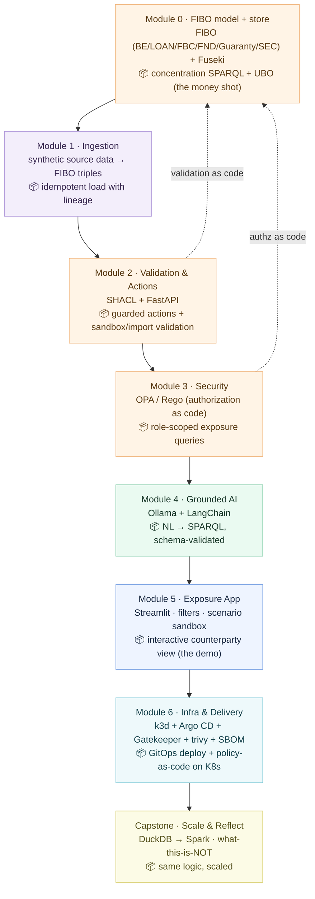

# Counterparty Concentration Lens — Lab Handbook

**A hands-on build of a standards-based (FIBO) counterparty exposure prototype**

This handbook is the student-facing companion to the build. It walks you, module by module, through constructing the **Counterparty Concentration Lens** — a learning prototype that gives a single, real-time, multi-entity view of counterparty exposure, built on the financial industry's open ontology (FIBO).

> **Authoritative build spec:** `CLAUDE.md` is the source of truth for the build (module plan, standards, verification gates). This handbook mirrors it and adds the *why* and the learning narrative. Where they ever differ, `CLAUDE.md` wins.

> ### 📌 Scope & limitations — read first
> This is a **learning prototype on synthetic data**, built to **production-shaped** standards (it demonstrates DevSecOps and engineering best practice) but **not production-hardened**. It demonstrates the architecture and the pattern; it is not a deployable system, not advice to any institution, and not affiliated with any bank or with EDM Council/OMG. See `../SECURITY.md`.

---

## The use case: counterparty concentration

Every module shares one domain so the layers connect. We model **counterparty / lending exposure** on **synthetic data only — never real institutional or personal data**.

The question the Lens answers — the one that is slow and manual in fragmented systems:

> *What is the true, total exposure to a single counterparty or borrower group — right now — across every product, entity, and relationship?*

Core objects (modelled on FIBO): `LegalEntity`, `Loan`, `Collateral`, `Guarantee`, `Limit`, `Exposure`.
Key idea: in FIBO a **counterparty is a *role*, not a class** — one legal entity can be a borrower on one loan, a guarantor on another, and a beneficial owner behind a third. That role machinery is what lets the model surface **multi-hop concentration** (shared collateral, guarantee chains, group ownership) that no single source system sees.

> **The "money shot":** a single query/screen that, given a counterparty group, returns total **connected** exposure including indirect paths — visibly larger than any direct-loan-only view. If a stakeholder sees one thing, it's this.

---

## Lab roadmap

**Sequencing:** the FIBO model and the concentration query come first (M0) — the conceptual core before any plumbing. Infrastructure (M6) comes last, when there is something worth deploying. Each module produces an independently demoable deliverable, built test-first and CI-green.

---

## Engineering standards (every module)

This is part of the deliverable, not an afterthought. Each module is **built test-first, linted, type-checked, and CI-green before it is "done"**, per `CLAUDE.md` and `docs/engineering-practices.md`:

- Tests (`pytest`) for logic and the API/SPARQL/SHACL paths.
- `ruff` (lint + format), `mypy` (types), pinned dependencies.
- Config via environment; no secrets in code or git.
- Conventional Commits; per-module README (run / test / verify).
- Security-as-code: SHACL (validation, M2) and OPA/Rego (authorization, M3) are tested artifacts; LLM-generated SPARQL (M4) is schema-validated and read-only.
- CI (GitHub Actions): lint → type → test → pip-audit → bandit → gitleaks → (M6) trivy + SBOM.

---

## Prerequisites & toolchain

| Tool | Used in | Install |
|------|---------|---------|
| Python 3.11+ | M0–M5 | python.org / pyenv |
| FIBO ontology files | M0 | github.com/edmcouncil/fibo (into `vendor/fibo/`) |
| Protégé (optional, authoring) | M0 | protege.stanford.edu |
| Apache Jena Fuseki | M0–M5 | jena.apache.org/download |
| rdflib / owlready2 | M0–M1 | `pip install rdflib owlready2` |
| dbt-duckdb (optional) / Python | M1 | `pip install dbt-duckdb` |
| FastAPI + uvicorn | M2 | `pip install fastapi uvicorn` |
| pySHACL | M2 | `pip install pyshacl` |
| Open Policy Agent | M3 | openpolicyagent.org |
| Ollama | M4 | ollama.com (`ollama pull llama3.2`) |
| LangChain | M4 | `pip install langchain langchain-community` |
| Streamlit | M5 | `pip install streamlit` |
| k3d + kubectl, Argo CD | M6 | k3d.io, argo-cd.readthedocs.io |
| Dev gates | all | `pip install -r requirements-dev.txt` |

All free / open-source. No cloud account or API key required.

---

## Module 0 — FIBO model + store + concentration query

**Folder:** `m0-ontology/` · **Stack:** FIBO (OWL) + Apache Jena Fuseki + SPARQL

### Learning objectives
Import and use a standards-based financial ontology; model counterparties as roles; query multi-hop exposure.

### Concept
FIBO is the financial industry's open ontology (EDM Council / OMG, OWL 2 DL + SHACL). Rather than invent a counterparty model, you adopt FIBO's: **Business Entities (BE)** for legal entities and ownership/control, **Loan (LOAN)** for loan contracts, **FBC / Debt & Equities** for debt instruments, **Foundations (FND)** for the contract/party/role machinery, and the **Guaranty** package for guarantees and collateral.

### Steps
1. Download the needed FIBO modules into `vendor/fibo/` (with an attribution README; FIBO is © EDM Council).
2. Author a thin **application ontology** that *imports* FIBO and adds only what's missing for the demo (e.g. an `Exposure` convenience view, a `Limit`).
3. Stand up Fuseki; load FIBO + your application ontology, resolving the import closure to just the modules you need.
4. Load **synthetic instances**: ~15–25 legal entities (some in group/ownership structures), loans, guarantees linking entities, shared collateral, per-counterparty limits. Use obviously-fake names (e.g. "Acme Holdings Pte Ltd", `LE-0001`).

### Deliverable — the money shot
A SPARQL query that, given a counterparty group, returns **total connected exposure including indirect paths** (guarantees + shared collateral + group ownership), and is demonstrably **larger** than the direct-loan-only total. Show the result rows.

### Verify
- [ ] FIBO + application ontology load cleanly into Fuseki
- [ ] Counterparties modelled as roles on shared legal entities
- [ ] Concentration query returns indirect exposure a per-system view would miss
- [ ] Tests pass; ruff/mypy clean; CI green

---

## Module 1 — Ingestion

**Folder:** `m1-ingestion/` · **Stack:** synthetic data generator + (dbt/DuckDB optional) + RDF loader

### Learning objectives
Map fragmented, source-style data into the FIBO model; understand lineage.

### Concept
Real exposure data arrives split across systems (loan system, KYC, collateral register), each keyed differently. The ingestion layer maps those fragments into one model — and records lineage, which BCBS 239 requires.

### Steps
1. Generate synthetic source-style tables as if from separate systems: `entities.csv`, `loans.csv`, `guarantees.csv`, `collateral.csv`, `limits.csv`.
2. (Optional) shape them with dbt + DuckDB; plain Python is fine.
3. Map rows → FIBO instances → triples in Fuseki, with simple lineage notes (which source produced which triples).

### Deliverable
A reproducible pipeline: synthetic sources → FIBO instances in the triplestore, with lineage.

### Verify
- [ ] Regenerate + reload is idempotent
- [ ] Triple counts match expected row counts
- [ ] The M0 concentration query still works on generated data
- [ ] Tests pass; CI green

---

## Module 2 — Validation & Actions (kinetic layer)

**Folder:** `m2-actions/` · **Stack:** SHACL (pySHACL) + FastAPI

### Learning objectives
Implement guarded state transitions — validate, then write, then log — and validation-as-code.

### Concept
A model can describe valid states; it cannot enforce them on writes. SHACL shapes provide the closed-world guardrails. This is where FIBO's SHACL-friendliness pays off.

### Steps
1. Write SHACL shapes for business rules (e.g. exposure must not exceed limit; a guarantee must reference two distinct existing entities).
2. Build FastAPI actions — `record-exposure`, `flag-limit-breach` — each: validate (SHACL) → write (SPARQL Update) → append audit log.
3. Test the guard: a valid action writes and logs; an invalid one (over-limit, dangling guarantee) is rejected before any write.

### Deliverable
Guarded actions that succeed when valid and are blocked when invalid, with an audit trail.

### Verify
- [ ] Valid action updates graph + logs who/what/when
- [ ] Invalid action rejected pre-write with a clear error
- [ ] SHACL shapes tested with valid + invalid fixtures
- [ ] Tests pass; CI green

---

## Module 3 — Dynamic Security

**Folder:** `m3-security/` · **Stack:** Open Policy Agent (OPA) + Rego

### Learning objectives
Enforce role/attribute-based access so the same query returns different results per user — authorization-as-code.

### Concept
Each user should see only what they're permitted to. Enforced at request time, external to application code.

### Steps
1. Define roles, e.g. `relationship_manager` (own portfolio only) vs `group_risk` (all).
2. Write a Rego policy returning allow/deny + a portfolio/desk filter.
3. Have the M2 API consult OPA and inject the filter into the exposure query.

### Deliverable
One "show exposures" request, two roles, two correctly different result sets.

### Verify
- [ ] RM sees only their portfolio; group risk sees all
- [ ] Policy external to app code
- [ ] Rego policy has allow/deny unit tests
- [ ] Tests pass; CI green

---

## Module 4 — Grounded AI query

**Folder:** `m4-ai/` · **Stack:** Ollama (local LLM) + LangChain · *needs local Docker/Ollama*

### Learning objectives
Ground an LLM in the FIBO model so answers come from governed data, not the model's memory — safely.

### Concept
The value is a natural-language interface to the *governed model*: the LLM generates a query, the data answers. Grounded, inspectable, and permission-safe.

### Steps
1. Pull a small local model (`llama3.2` or `phi`).
2. Provide the ontology schema (class/property names) as context.
3. Chain: question → generated SPARQL → **validate against schema, constrain to read-only** → execute → summarise.
4. Route generated queries through the M3 security filter.

### Deliverable
A grounded agent answering exposure questions (e.g. "total exposure to the Acme group?", "which counterparties are within 10% of their limit?", "show guarantee chains touching entity X").

### Verify
- [ ] ≥3 distinct questions produce valid SPARQL and correct answers
- [ ] Generated queries validated + read-only before execution (no unsafe execution)
- [ ] Security filter applied (no permission bypass)
- [ ] Tests pass; CI green

---

## Module 5 — Exposure App (the demo)

**Folder:** `m5-app/` · **Stack:** Streamlit

### Learning objectives
Build the operational interface that reads the model and invokes actions.

### Concept
The screen a risk officer would touch: live connected exposure plus the controls to act on it. It ties every prior module together — and it is the demo.

### Steps
1. Counterparty search → a **single exposure view** showing direct + indirect exposure, the concentration number, and the contributing paths (guarantees / collateral / group).
2. Scope the view by role (M3); wire an action button (e.g. flag breach, M2).
3. Optionally embed the M4 query box.

### Deliverable
A working exposure view — the Lens — where selecting a counterparty group shows connected exposure live, with the multi-hop contribution visible.

### Verify
- [ ] View reflects current triplestore state
- [ ] Multi-hop concentration visible vs direct-only
- [ ] Actions work; role scoping visible; rejected actions handled gracefully
- [ ] Tests pass; CI green

---

## Module 6 — Infrastructure & Delivery

**Folder:** `m6-infra/` · **Stack:** k3d (local Kubernetes) + Argo CD (GitOps) · *needs local Docker/k3d*

### Learning objectives
Containerise the stack, deploy via GitOps, and add supply-chain security (image scan + SBOM).

### Steps
1. Dockerfiles for the API (M2), agent (M4), app (M5); Fuseki has an official image.
2. k8s manifests (Deployments, Services); create a k3d cluster.
3. Install Argo CD; point an Application at the manifests in this repo.
4. Wire trivy image scanning and SBOM generation into CI.
5. Make a Git change (e.g. replica bump) and watch Argo CD reconcile.

### Deliverable
The entire Lens running on Kubernetes, deployed and updated through GitOps, with image scanning + SBOM.

### Verify
- [ ] Components run as pods, reachable via services
- [ ] Argo CD shows Synced/Healthy
- [ ] A Git commit triggers an automatic reconcile
- [ ] trivy scan + SBOM produced in CI

---

## Capstone — Scale & Reflect

**Folder:** capstone notes + reflection

### Tasks
1. **Scale demonstration:** replace the M1 transform with an equivalent Spark job on k3d; confirm identical output (*the logic was portable; only the engine changed*).
2. **Gap analysis + "What this is NOT" (required):** state plainly what the prototype is not — production-grade, scalable as built, concurrency-safe, hardened, integration-complete, or operated. Tie it to the build-vs-buy trade-off.

### Verify
- [ ] Spark pipeline output matches the DuckDB/Python version
- [ ] "What this is NOT" statement present, accurate, in your own words
- [ ] Build-vs-buy trade-off articulated with nuance

---

## Mapping to the platform stack

| Module | Layer | Lens component | Enterprise-platform analogue |
|--------|-------|----------------|------------------------------|
| 0 | Ontology (model) | FIBO + Fuseki | Semantic model |
| 1 | Compute / ingestion | synthetic sources → triples | Data plane + lineage |
| 2 | Ontology (kinetic) | SHACL + FastAPI | Validated action services |
| 3 | Ontology (security) | OPA | Dynamic per-object security |
| 4 | AI | Ollama + LangChain | Grounded platform AI |
| 5 | App | Streamlit | Operational apps |
| 6 | Substrate + delivery | k3d + Argo CD | Container substrate + GitOps |
| Capstone | Scale | Spark | Production compute |

---

## Notes for instructors / self-learners

- **Pacing:** Modules 0, 2, and 4 are the conceptual peaks; 1, 3, 5, 6 are shorter. M0 deserves the most time — the concentration query *is* the demo.
- **Checkpoints:** each module's verify list doubles as a self-assessment and a natural demo point.
- **Honesty:** keep synthetic-data-only throughout; the capstone "what this is NOT" is an assessed outcome, not a footnote. Archegos / BCBS 239 appear only as public facts explaining why the pattern matters — never as advice to any institution.
